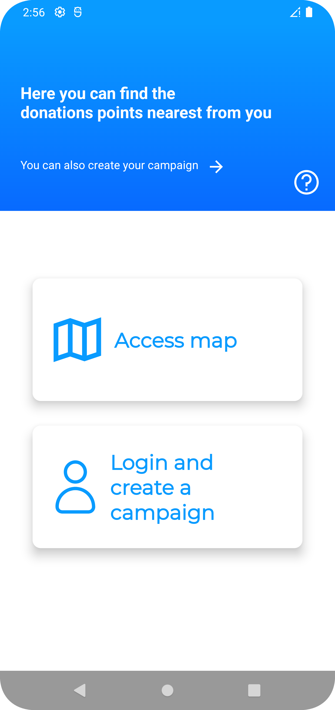
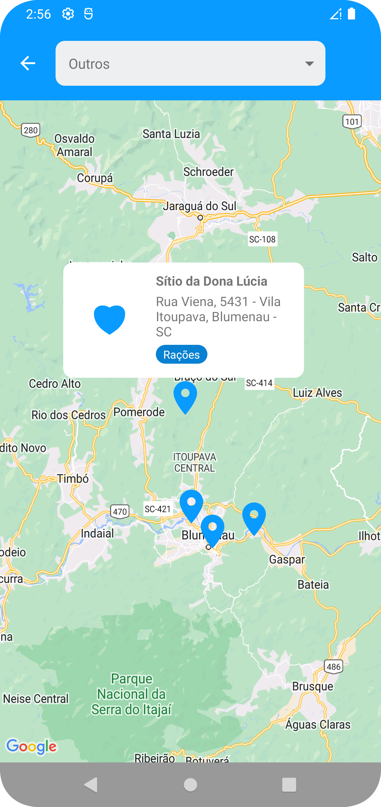
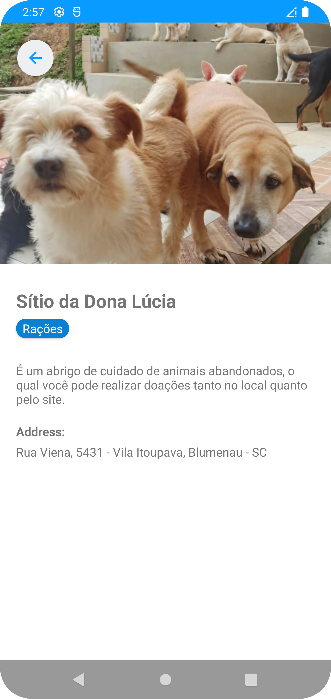
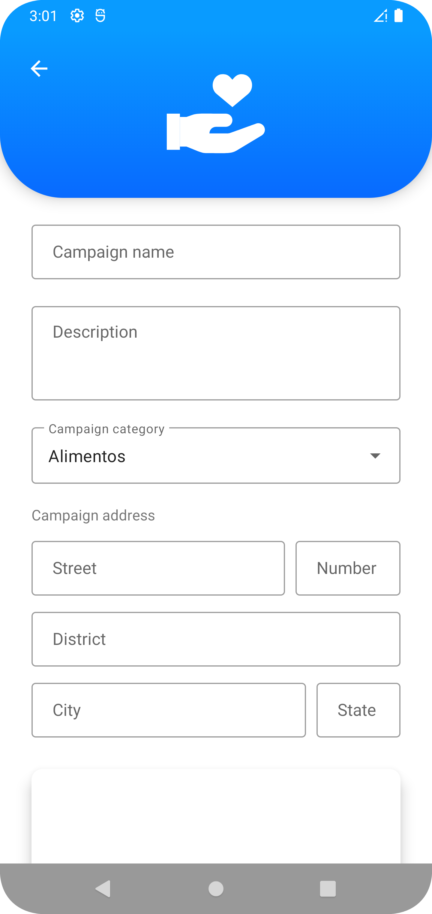

# PI_Application

PI_Application is a Capstone Project of IT course at Federal Institute of Santa Catarina. It's an Android application developed to help people to find donation places at their city.

PI_Application is being developed using Kotlin, Google Maps API, FirebaseFirestore and the MVVM architecture pattern.
